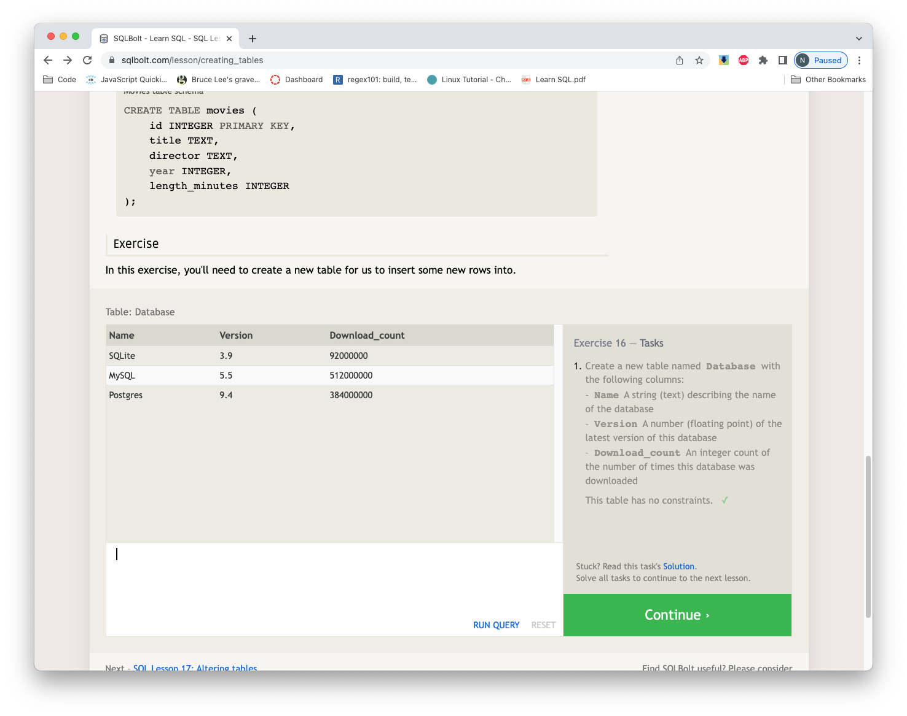

# Notes on SQL

## Things I learned about SQL

- SQL query instructions are written in ALL CAPS by convention only

- the * character is called "splat" and means "get all the columns in the table"

- results can be sorted very easily by any of the columns

- when something shows up multiple times in a query it can be reduced to a single instance with DISTINCT

- A subreddit with a list of threads is just a SQL query result

- Successive pages after the first page are defined with OFFSET

- different tables can be joined by associating a column in one to a column in another, like movie ids

- rows can be grouped with GROUP BY

- queries have order of operations like doing math, that determines how and what results are returned

- it's easy to insert and delete rows and columns like in Excel

- you can drop an entire table, like deleting a subsheet in Excel

## SQLBolt tutorial screen shots

